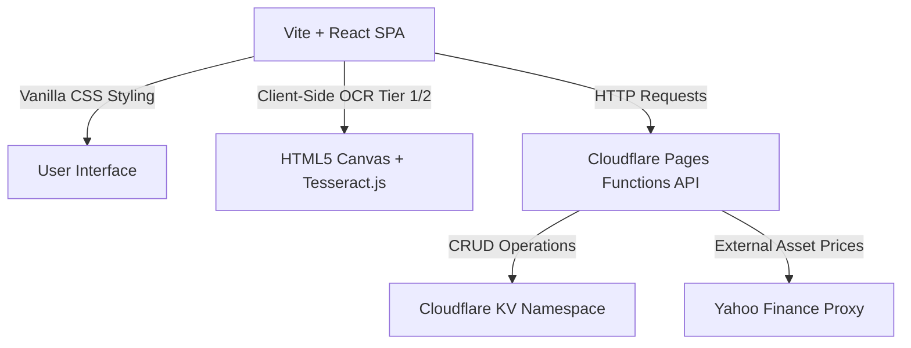
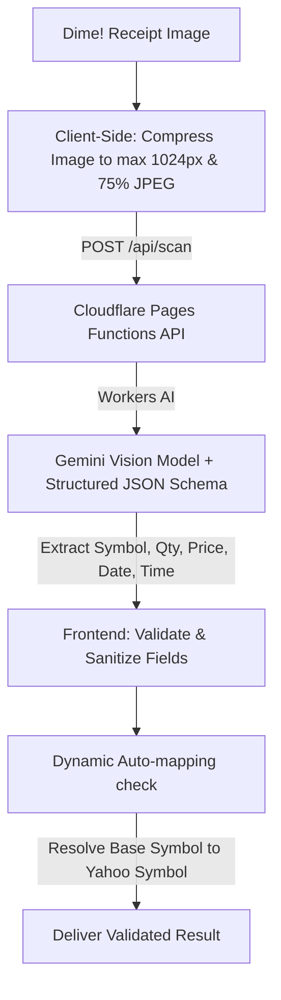

# Project Architecture & Logic Context

This document provides a comprehensive technical overview of the US Stock & Asset Tracker application’s architecture, core algorithms, database mappings, and specialized OCR systems.

---

## 1. System Architecture

The application is built as a lightweight, full-stack Serverless Single Page Application (SPA):

- **Frontend Client**: Vite-powered React. No heavy CSS framework is used; all styling and layout rules (dark mode, glassmorphism, responsive grid layouts) are fully defined in `src/index.css`.
- **Backend API Layer**: Cloudflare Pages Functions located in `/functions/api/`. These serverless endpoints handle proxying real-time market data and processing files.
- **Database Layer**: Data is persisted in Cloudflare KV namespaces associated with user UUIDs. This approach keeps queries extremely fast and completely serverless.

---

## 2. Core Calculation Logic (Weighted Average Cost Basis)

The core portfolio value and performance calculations are computed dynamically on the client side. The calculation sequence follows a **Weighted Average Cost Basis** model that processes historical transactions (lots) chronologically:

### Purchase (BUY / DEPOSIT)
When an asset transaction is a `BUY`:
1. Increment the current holding quantity:
   $$\text{newQty} = \text{currentQty} + \text{lotQty}$$
2. Re-compute the total accumulated cost and calculate the new weighted average cost basis:
   $$\text{newCost} = (\text{currentQty} \times \text{currentAvgCost}) + (\text{lotQty} \times \text{lotPrice})$$
   $$\text{currentAvgCost} = \frac{\text{newCost}}{\text{newQty}}$$

### Sale (SELL / WITHDRAWAL)
When an asset transaction is a `SELL`:
1. Decrement the current holding quantity:
   $$\text{newQty} = \text{currentQty} - \text{sellQty}$$
2. Calculate the **Realized Gain or Loss** immediately based on the current average cost:
   $$\text{realizedGain} = (\text{lotPrice} - \text{currentAvgCost}) \times \text{sellQty}$$
3. The weighted average cost basis ($\text{currentAvgCost}$) remains unchanged during a sell transaction.

---

## 3. Account Hierarchy & Multi-Broker Structure ("Tiered Account Structure")

The application models portfolios dynamically at multiple levels, which forms the account's hierarchical structure:

1. **Portfolio Tier (Top Level)**: The aggregated user portfolio. It combines all holdings to calculate Net Worth, Net Asset Value (NAV), total gains/losses, and daily performance metrics.
2. **Asset Category Tier (Second Level)**: Assets are grouped into distinct asset classes, each with its unique parameters:
   - **US Stocks (`stock`)**: Price updates and valuations are pulled in USD, converted dynamically to THB if selected using live exchange rates.
   - **Commodities (Gold/Oil) (`gold`)**: Supports Gold Spot (`GC=F`) and Crude Oil (`CL=F`). Styled with visual indicators.
   - **Cryptocurrencies (`crypto`)**: Calculated in USD with real-time volatility tracking.
   - **Cash/Fiat (`fiat`)**: Tracks liquid currency reserves (e.g., THB, USD) deposited in various banks.
3. **Broker/Bank Tier (Sub-Asset Level)**: Under each asset class, transactions and current holdings are grouped by **Broker** (for stocks/commodities/crypto, e.g., Dime!, Webull, Binance) or **Bank** (for cash/fiat, e.g., KBank, SCB, Bangkok Bank). This allows sub-portfolio analysis by tracking which broker or bank holds each individual share or deposit.

### P&L Reset & Removal Mappings
The system provides two core portfolio administrative operations within the P&L Breakdown modal to manage account history:
- **Clear Asset History**: Consolidates the transaction lots of an active asset into a single, clean starting BUY transaction at the current average price and holding quantity. This effectively resets accumulated Realized Gains/Losses (closed trades history) to 0 without affecting the asset's active cost basis or current holdings valuation.
- **Delete Asset holding**: Permanently deletes the asset record and its corresponding transaction lists from the user's portfolio. To ensure data integrity, the system strictly enforces a safety constraint preventing deletion if the asset has a remaining positive balance (`qty > 0`).

---

## 4. UI Symbol Clean-up & Display Suffix Hiding

To improve user experience and readability, the application introduces a global symbol clean-up mechanism:
- **Logic**: Suffixes required by data providers like Yahoo Finance (e.g. `.BK` for Bangkok Stock Exchange, `.HK` for Hong Kong, etc.) can make symbol labels look cluttered.
- **Implementation**: The application uses the `getDisplaySymbol` utility to strip exchange suffixes before rendering ticker names in the user interface (e.g., displaying `PTT.BK` as `PTT`). The full suffix is safely maintained in the backend storage (Cloudflare KV) to guarantee correct pricing calculations and API synchronization.

---

## 5. Optical Character Recognition (OCR) Server-Side Gemini Vision Engine & Auto-mapping

To parse trade receipts (particularly from the Dime! App), the application employs a serverless **Gemini Vision OCR Engine**:

### Server-Side Gemini Vision API
- **Logic**: Trade receipts are written in Thai/English with intricate layouts. Traditional OCR engine (Tesseract.js) fails on modern Thai UI fonts. The system utilizes Google's Gemini Vision API via Cloudflare Workers AI for near-perfect context-aware data extraction.
- **Client-Side Pre-processing**: To minimize payload sizes and prevent timeouts, the client compresses uploaded images to a maximum of 1024px (width/height) at 75% JPEG quality before transmitting them as Base64 to `/api/scan`.
- **Structured JSON Output**: The server requests output structured strictly under a JSON Schema (`getDimeReceiptSchema`). Gemini extracts the stock symbol, transaction quantity, actual executed price per share, date (converting Buddhist Era `พ.ศ.` years to Gregorian `C.E.`), time, and action (BUY/SELL).

### Dynamic Auto-mapping Check (Yahoo Finance Matcher)
- **Logic**: Extracted symbols from trade receipts are often raw ticker symbols (e.g. `"PTT"`) without exchange suffixes, which fails Yahoo Finance pricing queries.
- **Execution**: Upon successful OCR parsing, if a symbol lacks its suffix, the frontend sends a debounced query to the proxy autocomplete endpoint (`/api/prices?q=symbol`). It checks for suggestions starting with the base symbol (e.g. mapping `PTT` to `PTT.BK`) and automatically attaches the correct suffix to the transaction before queueing it.

---

## 6. AI Agent Guidelines & Ponytail Rules

To maintain codebase cleanliness and prevent over-engineering, the project utilizes the **Ponytail** agent skill ruleset (configured in `.cursor/rules/ponytail.mdc`):
- **Philosophy**: "The best code is the code you never wrote."
- **Standard Library & Native APIs**: The agent must prioritize standard JS features and browser APIs (e.g. HTML5 native elements, native array methods) over importing third-party libraries.
- **YAGNI**: Unnecessary code abstractions, premature optimization, and unused helper functions are strictly forbidden.
- **Shortcuts Documentation**: If the agent makes a conscious simplification or shortcut to keep code minimal, it must mark it with a `// ponytail:` comment detailing the limitation and the upgrade path.

