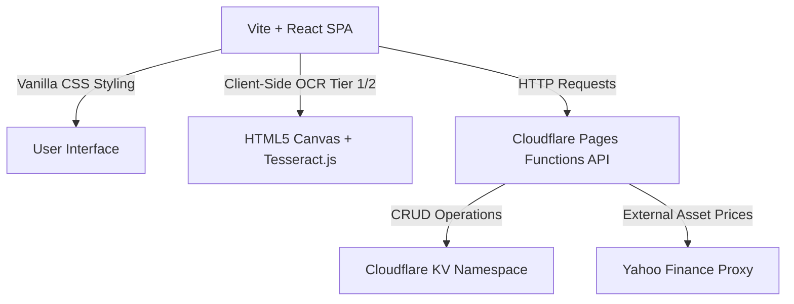
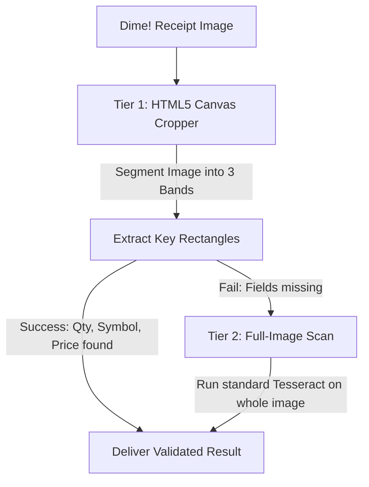

# Project Architecture & Logic Context

This document provides a comprehensive technical overview of the US Stock & Asset Tracker application’s architecture, core algorithms, database mappings, and specialized OCR systems.

---

## 1. System Architecture

The application is built as a lightweight, full-stack Serverless Single Page Application (SPA):

- **Frontend Client**: Vite-powered React. No heavy CSS framework is used; all styling and layout rules (dark mode, glassmorphism, responsive grid layouts) are fully defined in `src/index.css`.
- **Backend API Layer**: Cloudflare Pages Functions located in `/functions/api/`. These serverless endpoints handle proxying real-time market data and processing files.
- **Database Layer**: Data is persisted in Cloudflare KV namespaces associated with user UUIDs. This approach keeps queries extremely fast and completely serverless.

---

## 2. Core Calculation Logic (Weighted Average Cost Basis)

The core portfolio value and performance calculations are computed dynamically on the client side. The calculation sequence follows a **Weighted Average Cost Basis** model that processes historical transactions (lots) chronologically:

### Purchase (BUY / DEPOSIT)
When an asset transaction is a `BUY`:
1. Increment the current holding quantity:
   $$\text{newQty} = \text{currentQty} + \text{lotQty}$$
2. Re-compute the total accumulated cost and calculate the new weighted average cost basis:
   $$\text{newCost} = (\text{currentQty} \times \text{currentAvgCost}) + (\text{lotQty} \times \text{lotPrice})$$
   $$\text{currentAvgCost} = \frac{\text{newCost}}{\text{newQty}}$$

### Sale (SELL / WITHDRAWAL)
When an asset transaction is a `SELL`:
1. Decrement the current holding quantity:
   $$\text{newQty} = \text{currentQty} - \text{sellQty}$$
2. Calculate the **Realized Gain or Loss** immediately based on the current average cost:
   $$\text{realizedGain} = (\text{lotPrice} - \text{currentAvgCost}) \times \text{sellQty}$$
3. The weighted average cost basis ($\text{currentAvgCost}$) remains unchanged during a sell transaction.

---

## 3. Account Hierarchy & Multi-Broker Structure ("Tiered Account Structure")

The application models portfolios dynamically at multiple levels, which forms the account's hierarchical structure:

1. **Portfolio Tier (Top Level)**: The aggregated user portfolio. It combines all holdings to calculate Net Worth, Net Asset Value (NAV), total gains/losses, and daily performance metrics.
2. **Asset Category Tier (Second Level)**: Assets are grouped into distinct asset classes, each with its unique parameters:
   - **US Stocks (`stock`)**: Price updates and valuations are pulled in USD, converted dynamically to THB if selected using live exchange rates.
   - **Commodities (Gold/Oil) (`gold`)**: Supports Gold Spot (`GC=F`) and Crude Oil (`CL=F`). Styled with visual indicators.
   - **Cryptocurrencies (`crypto`)**: Calculated in USD with real-time volatility tracking.
   - **Cash/Fiat (`fiat`)**: Tracks liquid currency reserves (e.g., THB, USD) deposited in various banks.
3. **Broker/Bank Tier (Sub-Asset Level)**: Under each asset class, transactions and current holdings are grouped by **Broker** (for stocks/commodities/crypto, e.g., Dime!, Webull, Binance) or **Bank** (for cash/fiat, e.g., KBank, SCB, Bangkok Bank). This allows sub-portfolio analysis by tracking which broker or bank holds each individual share or deposit.

---

## 4. Optical Character Recognition (OCR) 2-Tier Sequence

To parser trade receipts (particularly from Dime! App), the application employs a highly optimized **2-Tier OCR Engine**:

### Tier 1: HTML5 Canvas Cropping & Split OCR
- **Logic**: A trade receipt image has a rigid structure but can cause OCR cross-talk (reading numbers from the wrong column/section).
- **Execution**: The client-side cropping engine divides the uploaded receipt into three distinct vertical coordinate bands:
  - **Band 1**: Stock Ticker Symbol and Action type (BUY/SELL).
  - **Band 2**: Transaction Share Quantity.
  - **Band 3**: Executed Unit Price.
- Tesseract.js runs separately on each cropped sub-image, resulting in close to 100% data extraction accuracy.

### Tier 2: Full-Image Tesseract Scan (Fallback)
- **Logic**: Used as a fallback if the canvas division fails or crucial data fields (Symbol, Quantity, Price) are not retrieved during Tier 1.
- **Execution**: Runs OCR on the full unmodified image and employs regular expression patterns to match values across the text.
